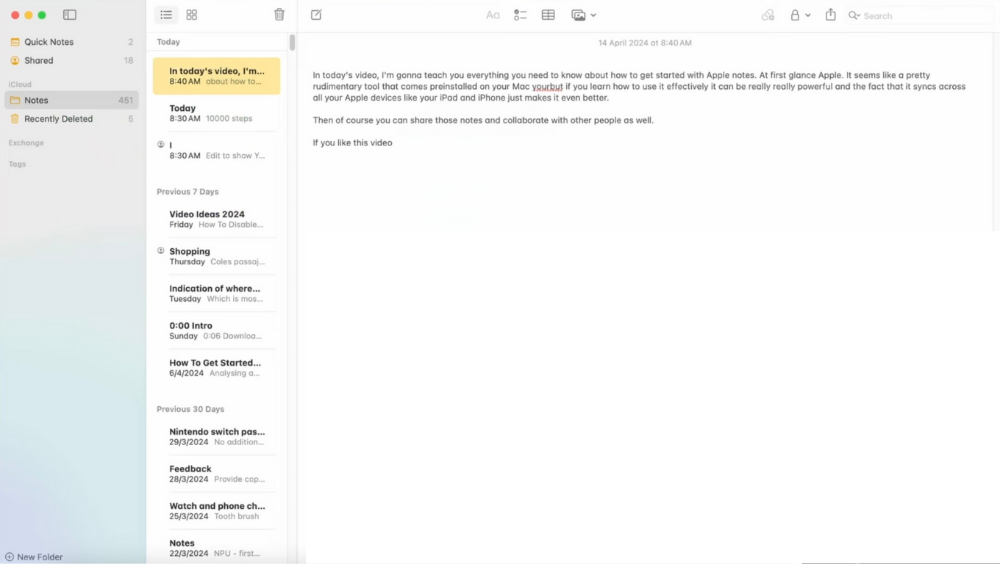
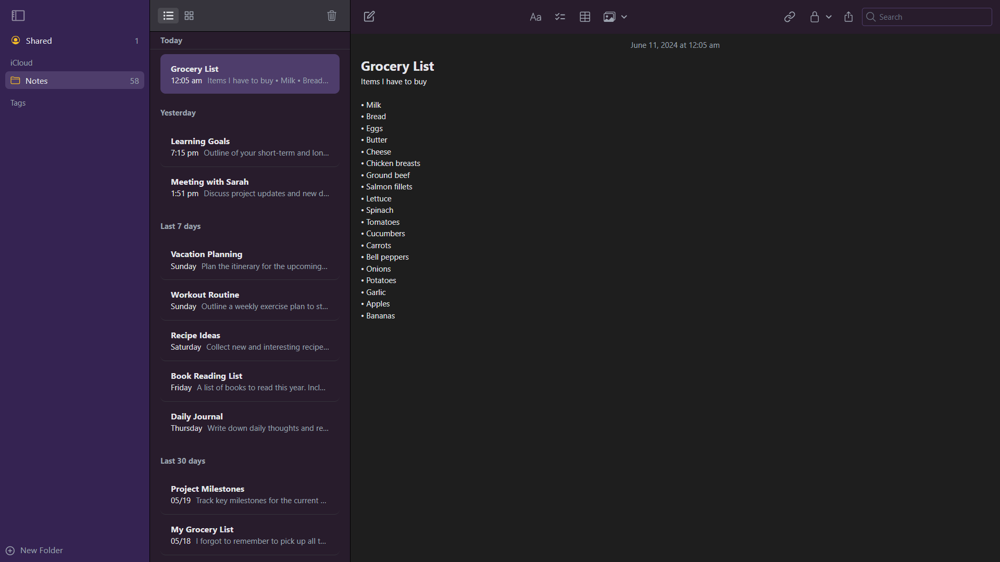
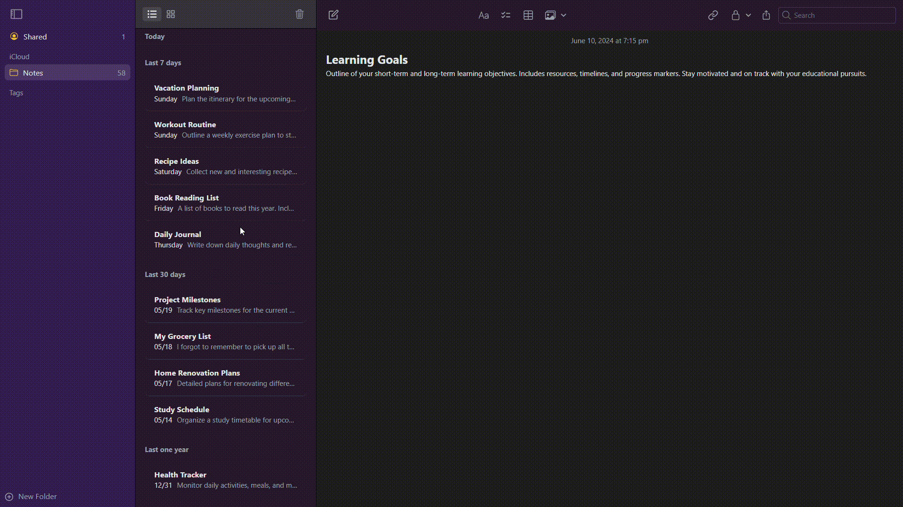

# Apple Notes Frontend

The Apple Notes application is an exact replica of the notes app for macOS. It is built using React for the frontend and Java/Spring Boot for the backend. The application performs typical notes functions and supports CRUD operations. This repository contains the frontend for the application. The backend source code can be found [here](https://github.com/Sheel-ui/apple-notes-backend).

## Table of Contents

- [Features](#features)
- [Demo](#demo)
  - [User Interface](#our-application-interface)
  - [Notes Management](#notes-management)
- [Setup Instructions](#setup-instructions)
- [Technologies Used](#technologies-used)

## Features

- Create, Read, Update, and Delete notes
- Simple and intuitive user interface
- Responsive design

## Demo

### Original Notes Interface


### Our Application Interface



### Notes Management


## Setup Instructions

To get the frontend application up and running on your local machine, follow these steps:

1. Clone the repository:
    ```bash
    git clone https://github.com/Sheel-ui/apple-notes-frontend.git
    ```

2. Navigate to the project directory:
    ```bash
    cd apple-notes-frontend
    ```

3. Install the necessary dependencies:
    ```bash
    npm install
    ```

4. Start the development server:
    ```bash
    npm run start
    ```

## Technologies Used

- **Frontend:** React, Tailwind
- **Backend:** Java, Spring Boot (backend source code can be found [here](https://github.com/Sheel-ui/apple-notes-backend))

